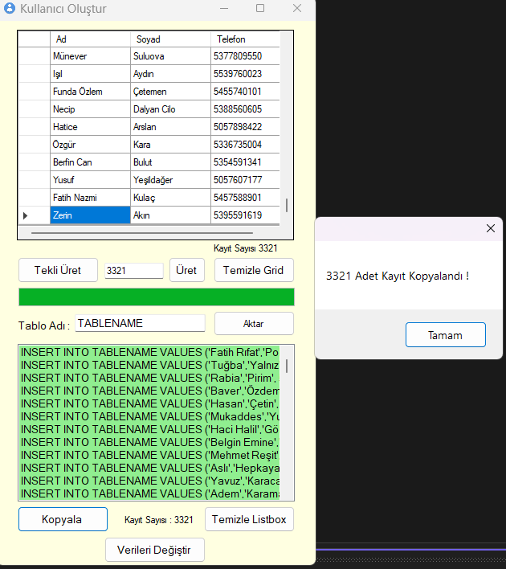
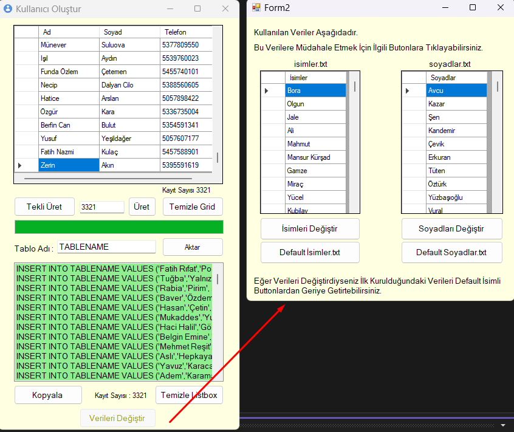
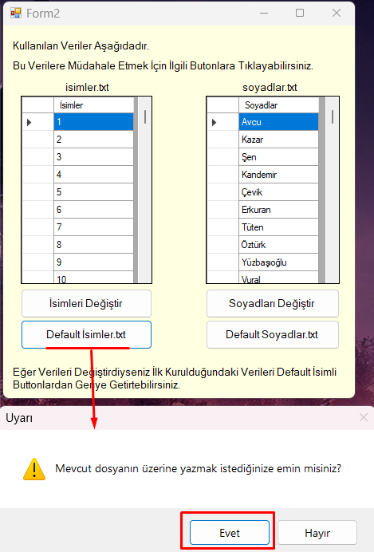
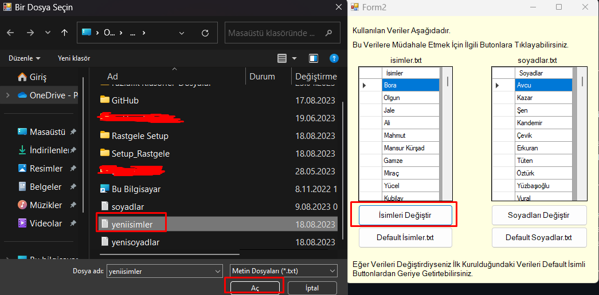
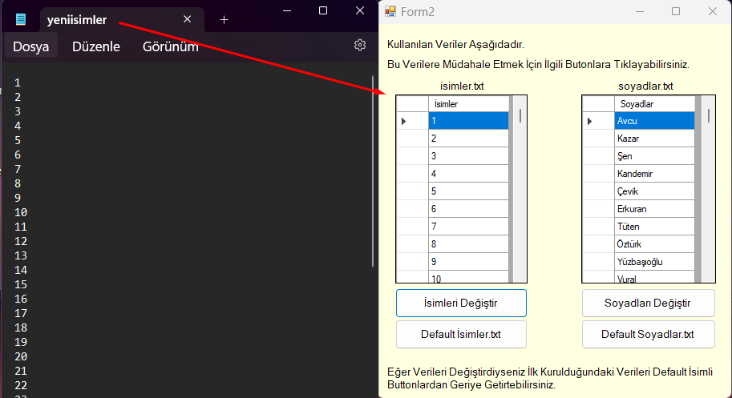
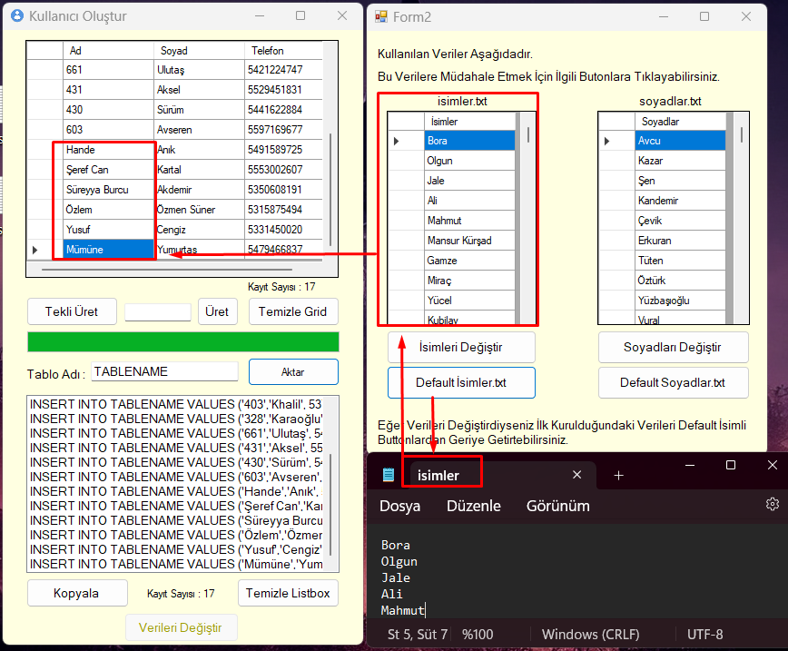
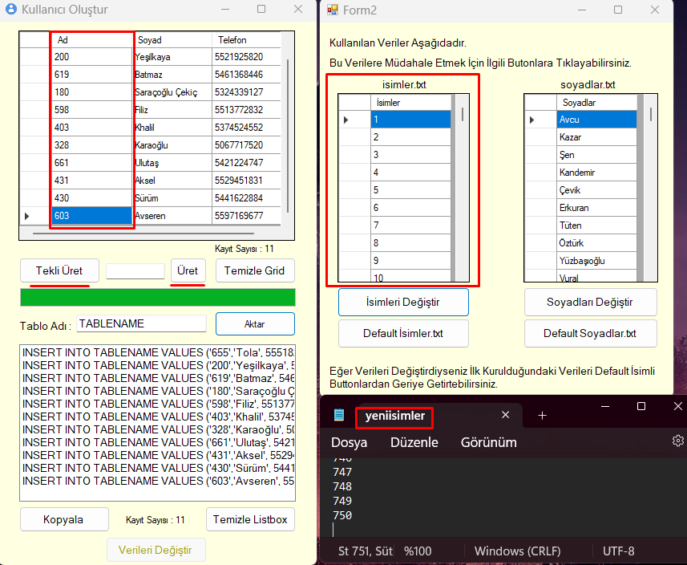

# 🎲 Rastgele Veri Üretici (Random Data Generator)

Bu proje, yazılım geliştirme, test süreçleri ve veritabanı yönetiminde ihtiyaç duyulan **gerçekçi test verilerini (Mock Data)** oluşturmak amacıyla geliştirilmiş bir **Windows Forms (C#)** uygulamasıdır.

SQL veritabanları için binlerce satırlık tutarlı veriyi (Ad, Soyad, Telefon) saniyeler içinde oluşturabilir, özelleştirebilir ve SQL sorgusu olarak dışarı aktarabilirsiniz.

## 🎯 Projenin Amacı

Yazılım testlerinde "test1", "deneme" gibi anlamsız veriler kullanmak yerine; projenizin prodüksiyon ortamında nasıl görüneceğini simüle eden gerçekçi veriler üretmenizi sağlar.
* **Gerçekçi:** Türkiye standartlarına uygun isim, soyisim ve telefon numaraları üretir.
* **Yüksek Performans:** 10.000 kaydı saniyeler içinde işleme kapasitesine sahiptir.
* **Esneklik:** Kendi veri setlerinizi (.txt) entegre edebilme imkanı sunar.

## 🚀 Öne Çıkan Özellikler

### 1. Akıllı Telefon Numarası Algoritması
Sıradan rastgele sayılar yerine, Türkiye'de aktif olarak kullanılan **31 farklı "500'lü" alan kodunu** (Örn: 532, 542, 555 vb.) baz alır. Numaranın geri kalanı rastgele üretilir ancak formatı gerçeğe uygundur.

### 2. Toplu Veri Üretimi ve Grid Yönetimi
İster tekli, ister binlerce veriyi aynı anda üretebilirsiniz. Performans optimizasyonu için tek seferde maksimum 10.000 kayıt sınırı konulmuştur. Üretim sürecini **Progress Bar** üzerinden canlı takip edebilirsiniz.

### 3. SQL Insert Script Oluşturucu (Database Ready)
Grid üzerinde üretilen verileri, veritabanınızdaki **tablo adını** girerek anında SQL `INSERT INTO` sorgularına dönüştürebilirsiniz. Çıktıyı kopyalayıp SQL Server Management Studio (SSMS)'da direkt çalıştırabilirsiniz.

### 4. Özelleştirilebilir Veri Kaynakları
Programın içinde gelen 1000'er adetlik havuz size yetmezse; kendi `isimler.txt` veya `soyadlar.txt` dosyalarınızı sisteme yükleyebilir, programın sizin verilerinizi rastgele dağıtmasını sağlayabilirsiniz. İstediğiniz an varsayılan ayarlara dönebilirsiniz.

## 🛠️ Teknik Detaylar ve Dosya Yapısı

Program, verileri dışarıdan okunabilir metin dosyaları (.txt) üzerinden işler. Bu yapı, programı yeniden derlemeden veri setini değiştirmenize olanak tanır.

* **Dil:** C#
* **Platform:** .NET Framework (Windows Forms)
* **Algoritma:** Randomize Array Selection & String Manipulation

## 💻 Kurulum ve Kullanım

1.  Bu repoyu indirin.
2.  Proje içerisindeki `Setup_Rastgele` klasörüne gidin.
3.  `Rastgele Veri Uretme.msi` veya `setup.exe` dosyasını çalıştırıp kurulumu tamamlayın.

---

## 📸 Uygulama Ekran Görüntüleri

---
**Geliştirici:** Bora Avcu
